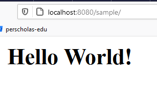

# JSP Project Template
* **Objective** - To create a service which can ...
* **Purpose** - To gain familiarity with the following topics:
    * JSPs
    * Apache Tomcat
    * Servlets
    


## For APIs

###  How to run web server with Apache Tomcat ?
* If Apache Tomcat is installed on your machine locally, the command below may work.

```
$mvnw tomcat7:run
```


* If Apache is not installed, please configure the project using the screenshots below


* Upon successfully running the application, you should see the following standard-output on your IDE console


* Navigate to "https://localhost:8080/sample" to verify that you can see the following webpage.


