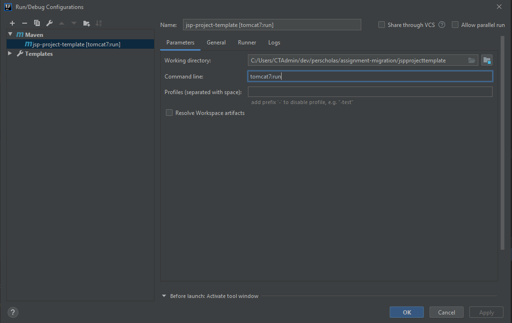

# JSP Project Template
* **Objective** - To create a service which can ...
* **Purpose** - To gain familiarity with the following topics:
    * JSPs
    * Apache Tomcat
    * Servlets
    


## For APIs

###  How to run web server with Apache Tomcat ?
* If Apache Tomcat is installed on your machine locally, the command below may work.

```
$mvnw tomcat7:run
```


* If Apache is not installed, please configure the project using the screenshots below




### Run test
```
$mvnw clean test
```

### Create WAR file
```
$mvnw clean package
```

###  Run in browser 
* http://localhost:8080/sample


#### Step to create server

1. สร้าง MySQL Database
```
docker container run -d -p 3306:3306  \
-e MYSQL_ROOT_PASSWORD=password \
-e MYSQL_DATABASE=wallet \
-e MYSQL_USER=user01 \
-e MYSQL_PASSWORD=xitgmLwmp \
--name db2 mysql:5.7.21
```
